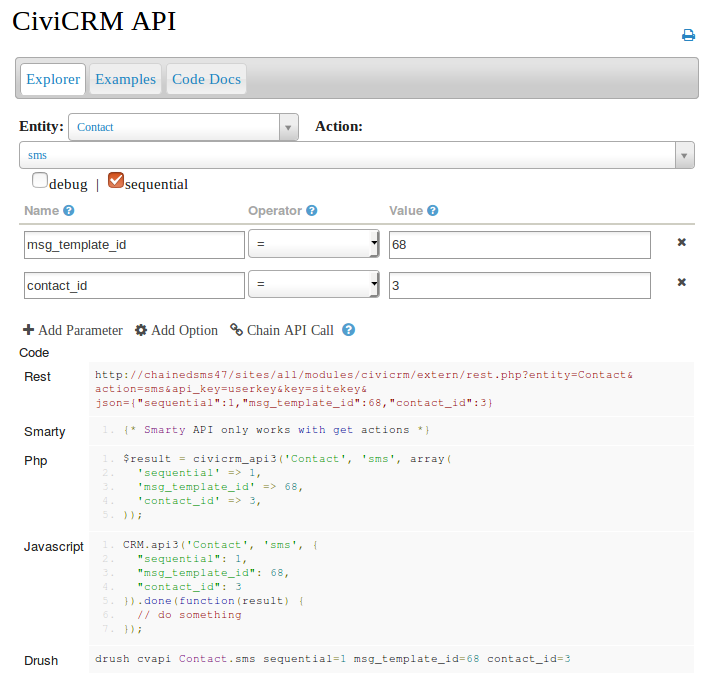

# Sending chained SMS

Currently the only way to start a Chained SMS is via an API call to the SMS action of the Contact API.

This action has two required parameters.

* The message template ID
* Either a contact ID or a group ID

For example the following call to the API sends the message with template ID 68 to the contact with ID 3.

`cv api contact.sms msg_template_id=68 contact_id=3`

And the following call sends the message with template ID 68 to the group with ID 7.

`cv api contact.sms msg_template_id=68 group_id=7`

You can use the API explorer to trigger your SMS message as follows

## Restarting a conversation

From time to time, a chained SMS conversation may stop. For example, if the contact sent an unexpected response for which no subsequent message had been defined. Here's a contrived example.

> **CiviCRM** Would you like to help with the election campaign? [please answer 'yes' or 'no']

> **Contact** Yes. I'd love to!

In this instance, we didn't respond because we were expecting a simple 'Yes', not a 'Yes. I'd love to!'. Once we have worked out what reply should have been sent in this situation, we can restart the chain at the appropriate place be an API call to this contact and the appropriate template.
